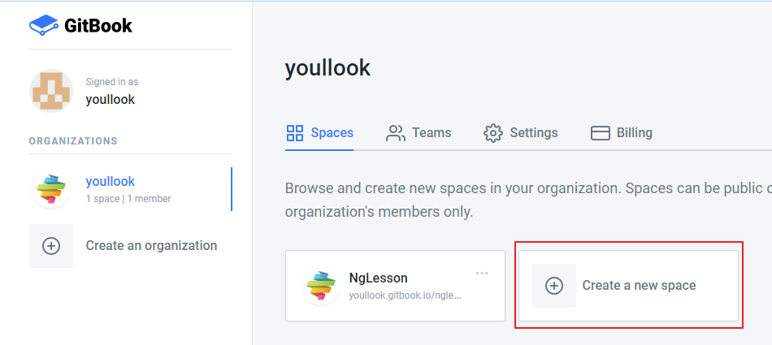

# 使用GitBook發布

## \[STEP1\] 註冊GitBook帳號

註冊[GitBook](https://www.gitbook.com/)並建立一個新的專案

### \[STEP2\] 按照步驟建立

### \[STEP3\] 建立完成後會多個剛剛建立的專案卡片，點選進入

### \[STEP4\] 點擊右下角的選項ICON

### \[STEP5\] 選擇 Integration -&gt; GitHub

Link your Resposity \(連結至Github專案\)，此時應該跳出授權視窗並要求輸入帳密

### \[STEP6\] 選擇連結的Gitbook專案

### \[STEP7\] 選擇該專案的主幹或是分支

### \[STEP8\] 選擇是否顯示Github編輯按鈕

### \[STEP9\] 選擇編輯模式

### \[SUCCESS\] 上傳成功後畫面!

點選Go live檢視結果 

