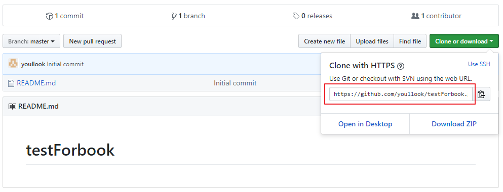

# 提交至Github

## \[STEP1\] Github建立專案

註冊[Github](https://github.com/)並建立一個新的專案  
勾選Initialize this responsitory with a READNE

## \[STEP2\] Clone Project至本地

## \[STEP3\] 將已建置GitBook的檔案拷貝進去並上傳至Github

